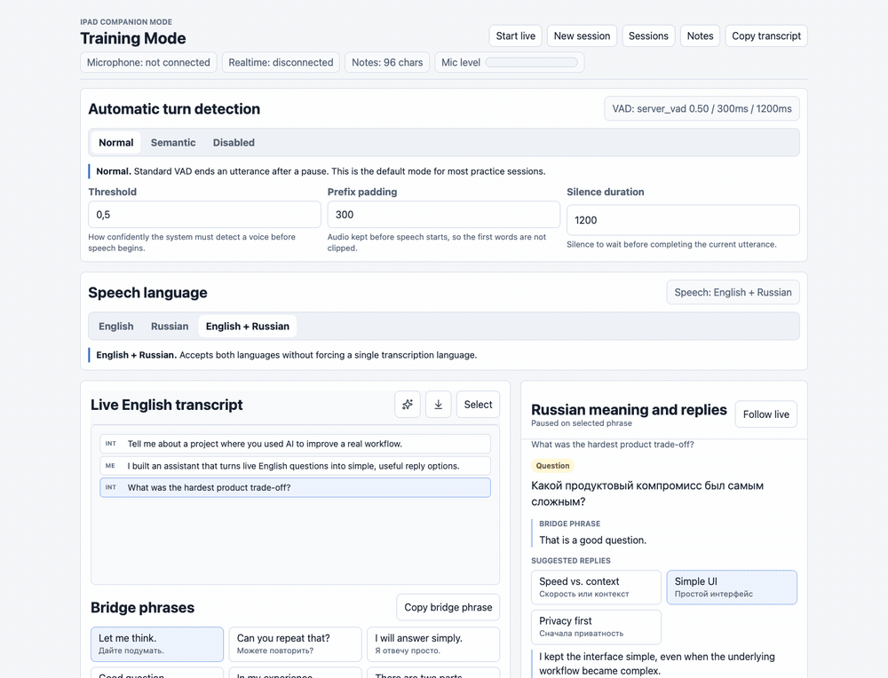
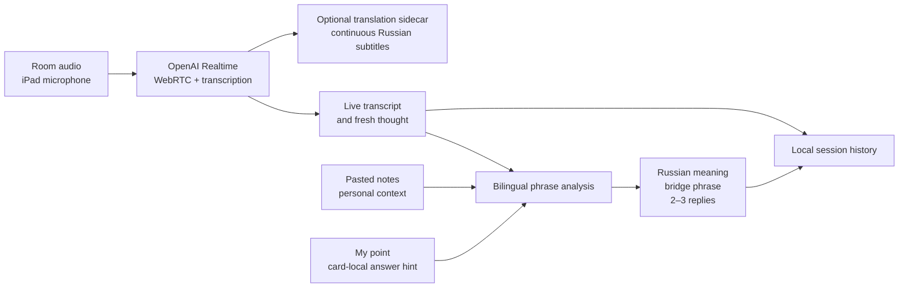
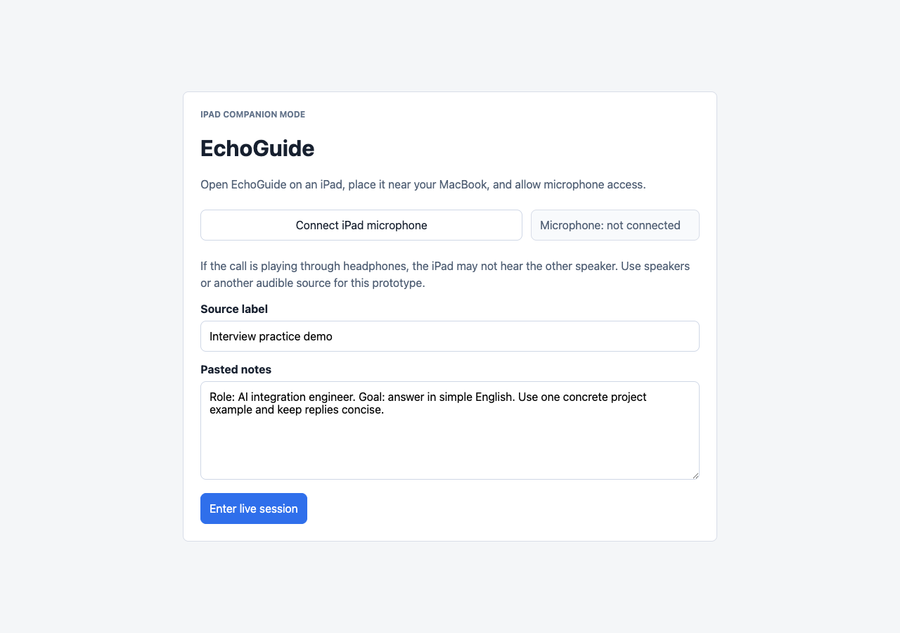

# EchoGuide

> A live bilingual interview copilot that turns spoken questions into clear meaning, natural bridge phrases, and short answers you can actually say.




*A quick tour of turn-detection modes, transcript selection, grounded reply options, local session history, and editable notes.*

**Project updates:** [See what changed](CHANGELOG.md).

EchoGuide is an experimental iPad companion for interview practice and live English conversations. It does not try to replace the speaker or generate a long, polished monologue. Its job is smaller and more practical: remove the pause between “I understand the question” and “I can answer it in simple English.”

## The problem

A translator solves only half of the problem during an interview. The user still needs to:

- understand what the interviewer is really asking;
- avoid an awkward silence while thinking;
- connect the answer to real personal experience;
- say it in clear English without reading a scripted speech.

EchoGuide turns each meaningful utterance into a compact bilingual card: Russian meaning, a bridge phrase, and two or three reply options. A short option expands into a complete sentence only when the user selects it.

## What works today

- live transcription through OpenAI Realtime and WebRTC;
- `English`, `Russian`, and bilingual speech modes;
- `server_vad`, `semantic_vad`, and manual turn control;
- Russian meaning beneath completed transcript turns and in the active phrase
  card, with an explicit `Question` / `Statement` marker;
- an opt-in continuous Russian subtitle block powered by a separate
  `gpt-realtime-translate` WebRTC sidecar;
- instant bridge phrases for filling a pause naturally;
- two or three concise suggested replies with translations and full sentences;
- `Pasted notes` as personal context for grounded answers;
- a card-local `My point` hint for regenerating the current answer from the
  user's intended facts or direction;
- manual card generation from a selected group of transcript turns;
- manual transcript messages and in-place corrections with speaker selection;
- selectable in-memory recovery of recent phrases without storing raw call audio;
- local session history without raw audio storage;
- privacy-safe microphone, WebRTC, and VAD diagnostics without transcripts or API keys;
- a reproducible model-evaluation harness for phrase-card quality, latency, and cost.

## How the main flow works



The frontend receives an ephemeral client secret from the local development API, streams microphone audio over WebRTC, and displays completed phrases as a dialogue log. For each meaningful phrase, a separate structured-output request combines recent conversation context with the user's notes. Session history and technical diagnostics stay local.

## First-run experience



The user places an iPad near the audio source, enables the microphone, and adds a small amount of context: role, project, verified facts, constraints, and preferred answer style. The microphone always starts through an explicit user action; browser permissions are never bypassed.

## What this repository demonstrates

This is more than a UI mockup. The project explores several engineering problems that are often hidden behind an AI demo:

- **Realtime integration:** WebRTC lifecycle, ephemeral credentials, VAD, and bilingual transcription.
- **Product constraints:** low cognitive load, concise answers, and explicit human-in-the-loop selection.
- **Grounding:** personal context with strong instructions not to invent roles, projects, or metrics.
- **Reliability:** structured outputs, runtime validation, automated tests, and a dedicated model-evaluation harness.
- **Observability:** privacy-safe audio-path diagnostics that distinguish browser, WebRTC, and VAD failures.
- **Privacy by design:** raw audio, transcripts, personal notes, certificates, and API keys are excluded from Git.

## Run locally

You need Node.js 20+ and an OpenAI API key.

```bash
npm install
cp .env.example .env.local
```

Add `OPENAI_API_KEY` to `.env.local`, create a local HTTPS certificate, and start the app:

```bash
npm run dev:cert
npm run dev
```

Open `https://localhost:5173/`. For an iPad, configure a local hostname with
`ECHOGUIDE_DEV_HOST` and follow the [local development guide](docs/local-development.md).

> [!IMPORTANT]
> The current Vite server combines the frontend with local, development-only API endpoints. This is a runnable prototype for a controlled local environment, not a production-ready public deployment.

## Validate the project

```bash
npm run lint
npm run test
npm run build
npm run smoke
```

The phrase-card model comparison uses real API calls and runs separately:

```bash
npm run eval:models
```

The evaluation-only model settings live in `.env.local`:

| Variable | Purpose |
| --- | --- |
| `ECHOGUIDE_EVAL_MODELS` | Comma-separated candidate models. The runner sends every evaluation case to each model and compares their phrase cards. |
| `ECHOGUIDE_EVAL_JUDGE_MODEL` | Independent judge model that scores the candidate cards for grounding, interview usefulness, concise A2/B1 English, and Russian-layer quality. |
| `ECHOGUIDE_EVAL_JUDGE_REASONING_EFFORT` | Reasoning effort passed to the judge model. Higher effort can make judging slower and more expensive. |

These variables affect only `npm run eval:models`; the live phrase-card model is
configured separately through `OPENAI_BILINGUAL_MODEL`.

Fast Russian captions use a separate `OPENAI_TRANSLATION_MODEL` setting, which
defaults to `gpt-5-nano` with `OPENAI_TRANSLATION_REASONING_EFFORT=minimal`. The
translation request starts as soon as Realtime completes a transcript turn and
does not wait for the fuller phrase-card analysis.

An independent experimental subtitle block can be started after `Start live`.
It reuses the microphone stream through a second WebRTC peer connection to the
dedicated Realtime translation endpoint. Its defaults are
`OPENAI_REALTIME_TRANSLATION_MODEL=gpt-realtime-translate` and
`OPENAI_REALTIME_TRANSLATION_LANGUAGE=ru`. The sidecar stays opt-in because it is
an additional active Realtime session; translated audio is not played.

The methodology, rubric, and current results are documented in [docs/model-evaluation.md](docs/model-evaluation.md).

## Technology

| Area | Technology |
| --- | --- |
| UI | React 19, TypeScript, Vite, CSS |
| Speech | OpenAI Realtime API, WebRTC, `gpt-4o-transcribe`, optional `gpt-realtime-translate` |
| Phrase cards | OpenAI Responses API, JSON Schema structured outputs |
| State | Browser setup preferences, server-side local notes and JSON session history |
| Quality | Vitest, Testing Library, TypeScript checks, model-evaluation fixtures |
| Diagnostics | Privacy-safe JSONL events, WebRTC stats, audio counters |

## Prototype status and limitations

EchoGuide is an early runnable prototype:

- the primary flow uses an iPad microphone and audible room audio;
- it cannot directly capture a conversation played only through headphones;
- production authentication, cloud persistence, and a standalone backend are not implemented yet;
- the local development server must not be exposed directly to the public internet;
- live-session cost depends on the selected OpenAI models and conversation length.
- audio recovery is available only while the live session is running; stopping
  live mode clears the in-memory audio buffer.

## Roadmap

- simplify the control surface for non-technical users;
- separate the production backend from the Vite development plugin;
- move local knowledge persistence behind an authenticated production backend;
- evaluate latency and usefulness across a series of practice interviews;
- define production-grade authentication, storage, and deployment boundaries.

## Project map

- [Product scope](docs/product.md) — the problem, user journey, and MVP boundary;
- [Architecture](docs/architecture.md) — Realtime, analysis, storage, and diagnostics;
- [Model evaluation](docs/model-evaluation.md) — reproducible text-model comparison;
- [Local development](docs/local-development.md) — HTTPS, iPad, and validation setup;
- [Knowledge-pack example](docs/personal-knowledge-pack.example.md) — safe grounding template.

Feedback is welcome on live-assistance UX, Realtime/WebRTC architecture, and evaluation of AI-generated replies.

## License

EchoGuide is available under the [MIT License](LICENSE).
