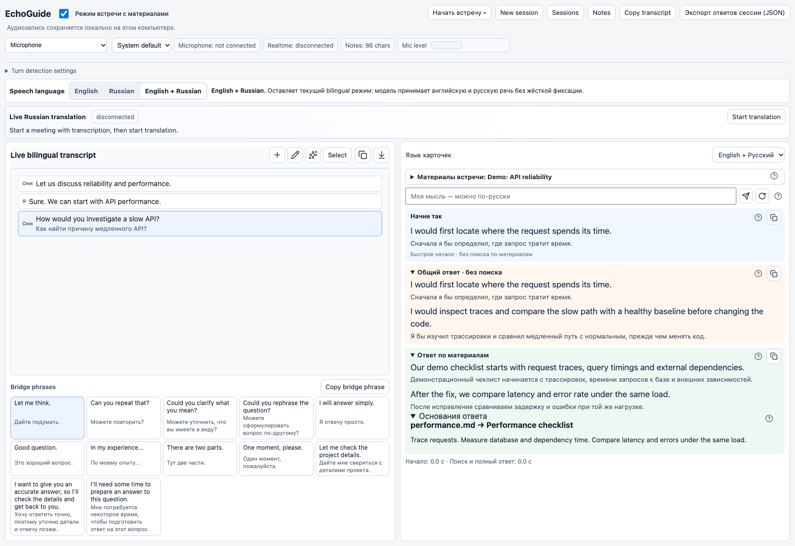
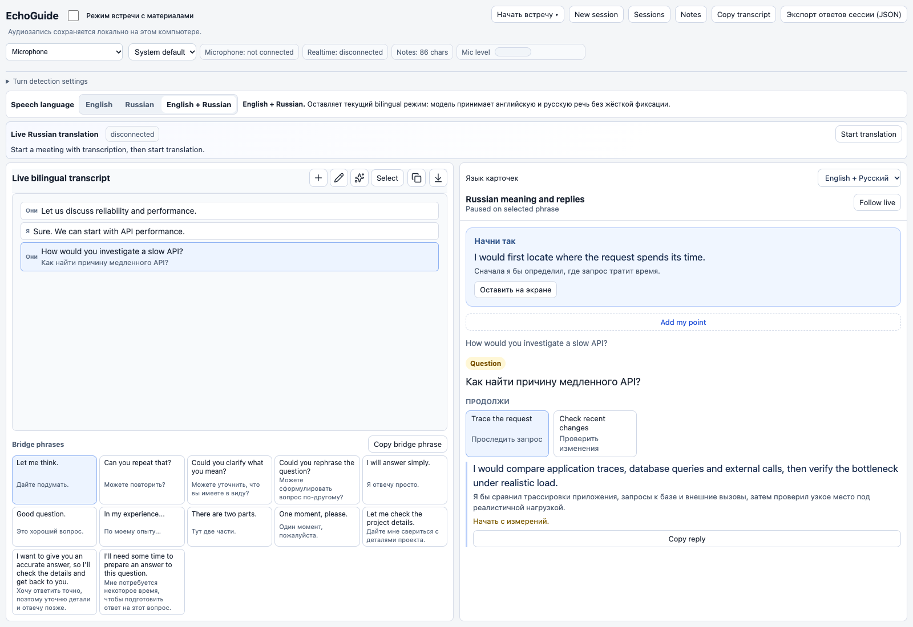
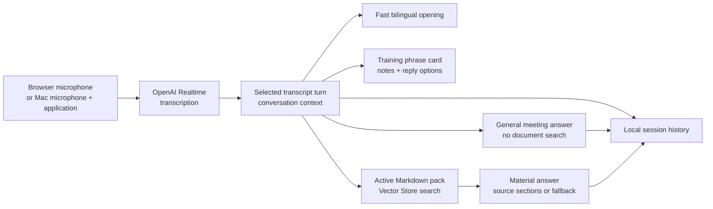

# EchoGuide

> A bilingual companion for interview practice and live meetings: understand the question, start speaking, and check answers against your materials.




*Current Meeting Mode. Screenshots captured on October 2, 2026 use synthetic dialogue and mocked API responses. They illustrate the interface, not live transcription, model quality, or response latency.*

**Project updates:** [Changelog](CHANGELOG.md).

EchoGuide helps a Russian-speaking participant follow an English conversation and respond in short, natural sentences. It runs locally on a computer, with a browser microphone for room audio or a MacBook capture mode for calls in headphones. An iPad can connect to the local HTTPS server as a companion screen.

## Two ways to use it

### Training Mode

Practice interviews with a live bilingual transcript, Russian meaning, ready-to-use bridge phrases, and short reply options. A separate fast request offers a contextual opening before the full phrase card arrives. Select a continuation, add your own point, or pin an opening while thinking.



*The same synthetic question in Training Mode. No microphone or external model session was started for these screenshots.*

### Meeting Mode with materials

Enable **Режим встречи с материалами**, upload a named Markdown pack, wait for it to become ready, and explicitly select it. Selecting a transcript turn starts three independent paths:

- **Fast opening:** a short phrase based on recent dialogue, without document search.
- **General answer:** a standalone answer based on the question and conversation, without document evidence. It must not invent personal experience or project facts.
- **Answer from materials:** searches the active pack and shows a supported answer with expandable source sections, or reports missing/conflicting evidence.

A missing document answer does not prevent the general answer from appearing. Request failures and unfinished questions have separate statuses; the app does not recommend an answer that was never received. Use **Моя мысль** to supply your facts or direction and **Новый вариант** to request another attempt.

Meeting context includes preceding speech from the last twenty minutes within size limits, plus a rolling summary of older turns. Saved cards retain their original wording and attempts; reopening a session restores them without automatic regeneration. See the [meeting assistant guide](docs/meeting-assistant.md) for indexing, context, history, and cleanup details.

## What works today

- OpenAI Realtime transcription over WebRTC, with English, Russian, or bilingual speech settings;
- server VAD, semantic VAD, and manual turn control;
- Russian meaning, contextual openings, bridge phrases, and concise reply continuations;
- English + Russian or Russian-only card display, remembered without regenerating replies;
- personal notes and a card-local answer hint;
- Markdown material packs with OpenAI Vector Store retrieval and visible sources;
- manual transcript entry, corrections, speaker selection, and grouped phrase cards;
- transcript following or a pinned selection, copy actions, and meeting-answer JSON export;
- local session history, audio recording, playback, MP3 download, and deletion;
- audio-only recording without transcription;
- optional continuous Russian subtitles through a separate Realtime translation session;
- privacy-safe audio diagnostics and synthetic model-evaluation runners.

## Audio and recording

Choose **Microphone** for audible room audio, including iPad interview practice. This cannot hear a call played only through headphones.

Choose **MacBook: microphone + call application** for a local Mac call. A Swift helper captures the microphone and a selected application's audio as separate transcription sources. Requires macOS 15+, native permissions, and localhost access; it does not require BlackHole. Build the helper with `npm run mac-audio:build` and follow the [Mac audio runbook](docs/mac-audio.md).

**Начать встречу** offers live assistance with recording or audio-only recording. Stop the meeting to finish the recording, then open it in **Sessions → Аудиозаписи**. Recordings stay on the server computer. MP3 export requires FFmpeg with `libmp3lame`; Mac audio-only capture needs no OpenAI transcription session. See [session recording](docs/session-recording.md) for formats, limits, and recovery.

## How it works


```mermaid
flowchart LR
    A["Browser microphone<br/>or Mac microphone + application"] --> B["OpenAI Realtime<br/>transcription"]
    B --> C["Selected transcript turn<br/>conversation context"]
    C --> Q["Fast bilingual opening"]
    C --> T["Training phrase card<br/>notes + reply options"]
    C --> G["General meeting answer<br/>no document search"]
    C --> R["Active Markdown pack<br/>Vector Store search"]
    R --> M["Material answer<br/>source sections or fallback"]
    C --> H["Local session history"]
    G --> H
    M --> H
```

The local development API keeps the OpenAI API key on the server and gives the browser ephemeral Realtime credentials. Text generation uses the Responses API with structured outputs and runtime validation. General answers are separate from document-supported answers; generated openings and conversation summaries are not documentary evidence.

Audio, transcripts, notes, and answer history are stored locally, but **local storage does not mean offline processing**: live audio and generation context go to OpenAI, and uploaded meeting packs are indexed in OpenAI Vector Stores. Packs remain there until deleted through the app. Private runtime files, certificates, and API keys are excluded from Git.

## Run locally

You need Node.js 20+ and an OpenAI API key for transcription and generated assistance.

```bash
npm install
cp .env.example .env.local
```

Set `OPENAI_API_KEY` in `.env.local`, then:

```bash
npm run dev:cert
npm run dev
```

Open `https://localhost:5173/`. Choose your audio source, add verified notes, and enter the live screen. Starting capture always requires an explicit action. For an iPad, configure `ECHOGUIDE_DEV_HOST` and follow the [local development guide](docs/local-development.md).

For Mac application capture:

```bash
npm run mac-audio:build
```

Then open `https://localhost:5173/mac-audio` and configure the sources before starting a meeting.

> [!IMPORTANT]
> The Vite server includes development-only API endpoints. Production authentication, hosted persistence, and a standalone production backend are not implemented. Do not expose this server directly to the public internet.

## Validation and model configuration

```bash
npm run lint
npm run test
npm run build
npm run smoke
```

Paid API evaluations run separately on synthetic data:

```bash
npm run eval:models
npm run eval:quick-start
npm run eval:meeting
```

`eval:meeting` creates and removes synthetic cloud resources. The [evaluation guide](docs/model-evaluation.md) explains fixtures, scoring, and limitations; successful synthetic runs do not guarantee every live answer or latency.

| Setting | Purpose |
| --- | --- |
| `OPENAI_BILINGUAL_MODEL`, `OPENAI_BILINGUAL_REASONING_EFFORT` | Shared phrase-card and meeting generation settings; current defaults are GPT-6.1 Sol and low reasoning effort. |
| `OPENAI_TRANSLATION_MODEL`, `OPENAI_TRANSLATION_REASONING_EFFORT` | Independent fast transcript translation; defaults are `gpt-5-nano` and `minimal`. |
| `OPENAI_REALTIME_TRANSLATION_MODEL`, `OPENAI_REALTIME_TRANSLATION_LANGUAGE` | Opt-in streaming translation sidecar; defaults are `gpt-realtime-translate` and `ru`. This adds a separate active Realtime session. |
| `ECHOGUIDE_EVAL_MODELS`, `ECHOGUIDE_EVAL_JUDGE_MODEL`, `ECHOGUIDE_EVAL_JUDGE_REASONING_EFFORT` | Evaluation-only candidate and judge settings; do not change the live model. |

See [.env.example](.env.example) for the full configuration. Quick openings use separate model settings and a shorter deadline.

## Prototype boundaries

- A browser microphone needs audible audio; application capture is currently macOS-only.
- UI copy is a mix of English and Russian, aimed at Russian-speaking participants.
- Audio capture quality and device permissions still require real-device checks.
- An answer from materials is limited by the indexed evidence; a general answer may still be wrong and is not proof of personal or project facts.
- API cost depends on model settings, context length, indexing, and session duration.
- In-memory recent-audio recovery ends when live mode stops; saved recordings have a separate lifecycle.

Next work focuses on simpler controls, broader practice evaluations, and a separate authenticated production backend with clear storage and deployment boundaries.

## Project map

- [Product scope](docs/product.md)
- [Architecture](docs/architecture.md)
- [Meeting assistant](docs/meeting-assistant.md)
- [Mac audio](docs/mac-audio.md)
- [Session recording](docs/session-recording.md)
- [Model evaluation](docs/model-evaluation.md)
- [Local development](docs/local-development.md)
- [Personal knowledge template](docs/personal-knowledge-pack.example.md)

Feedback is welcome on conversational UX, Realtime integration, retrieval grounding, and evaluation of short spoken replies.

## License

EchoGuide is available under the [MIT License](LICENSE).
