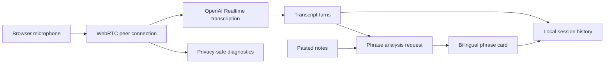

# Architecture

## Overview

EchoGuide separates live speech transcription from bilingual phrase analysis. Realtime handles the audio path; the Responses API turns completed phrases into structured, grounded cards.

## Runtime components

### React application

`src/App.tsx` owns setup memory and switches between onboarding and Training Mode. `TrainingLivePanel` coordinates microphone state, Realtime connection, transcript turns, phrase cards, reply selection, local notes, session history, and diagnostics.

### Local development API

`vite.config.ts` installs `createRealtimeDevServerPlugin()`. The plugin exposes development-only routes for:

- ephemeral Realtime client secrets;
- bilingual phrase analysis;
- optional local knowledge loading;
- session-history persistence;
- diagnostic event persistence.

The OpenAI API key remains on the local Node.js side. Browser code receives only an ephemeral Realtime credential.

### Realtime audio path

`connectRealtimeTranscription()` creates a WebRTC peer connection, attaches the microphone track, and uses the Realtime data channel for session updates and transcription events.

The primary mode is transcription-only. EchoGuide does not request model audio output or create a speaking voice-agent session.

### Turn detection

The user can select:

- `server_vad` for pause-based utterance completion;
- `semantic_vad` for meaning-aware completion;
- disabled automatic detection for diagnostics.

The selected settings are persisted locally and sent through `session.update` after the data channel opens.

### Phrase analysis

Completed meaningful phrases are analyzed separately through the Responses API. The request combines:

- the active transcript phrase;
- a bounded window of recent meaningful turns;
- a bounded personal knowledge context;
- a strict JSON Schema response contract.

The resulting card contains the normalized thought, speaker role, Russian meaning, question marker, bridge phrase, and two or three bilingual suggested replies.

### Local persistence

Setup preferences use browser `localStorage`. Training sessions are written to `.echoguide/sessions/history.json` by the local development API. Raw audio is not stored.

## Diagnostics and privacy

The diagnostic path records connection states, microphone-track lifecycle, aggregate audio levels, WebRTC outbound counters, VAD lifecycle, and safe error codes.

It must never record:

- raw audio;
- transcript text;
- pasted notes or knowledge context;
- API keys or ephemeral secrets.

When local speech levels rise but the server does not acknowledge speech, WebRTC counters help distinguish a frozen outbound sender from a server-side VAD miss.

## Production boundary

The Vite plugin is intentionally local and development-only. A production deployment needs a standalone authenticated backend, explicit storage and retention policies, rate limiting, centralized observability, and user-controlled deletion.
