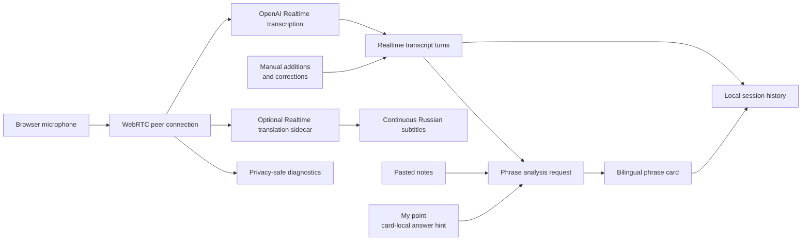

# Architecture

## Overview

EchoGuide separates live speech transcription from bilingual phrase analysis. Realtime handles the audio path; the Responses API turns completed phrases into structured, grounded cards.

## Runtime components

### React application

`src/App.tsx` owns setup memory and switches between onboarding and Training Mode. `TrainingLivePanel` coordinates microphone state, Realtime connection, transcript turns, phrase cards, reply selection, local notes, session history, and diagnostics.

### Local development API

`vite.config.ts` installs `createRealtimeDevServerPlugin()`. The plugin exposes development-only routes for:

- ephemeral Realtime client secrets;
- ephemeral Realtime translation client secrets;
- bilingual phrase analysis;
- local knowledge loading and replacement through `GET` / `PUT`;
- session-history persistence;
- diagnostic event persistence.

The OpenAI API key remains on the local Node.js side. Browser code receives only an ephemeral Realtime credential.

### Realtime audio path

`connectRealtimeTranscription()` creates a WebRTC peer connection, attaches the microphone track, and uses the Realtime data channel for session updates and transcription events.

The same browser audio monitor that calculates privacy-safe microphone levels keeps
a rolling 60-second mono PCM buffer in memory. `Recover phrases` exports only the
latest 30 seconds as a temporary WAV blob and sends it to the local development
API. The server forwards that bounded file to `/v1/audio/transcriptions`, splits
the complete transcript into chronological phrase candidates, and returns the
list without exposing the server API key. Selecting a candidate opens the existing
message editor; the list remains available after save or cancel, and
`Refresh phrases` replaces it with one new bounded transcription result.

The recovery recorder is activated from the `Start live` user gesture before the
client-secret request and WebRTC signaling. This keeps local PCM capture independent
from Realtime connection latency and satisfies iPad Web Audio activation rules. If
WebKit still reports a suspended or interrupted context, the UI keeps the
`Enable recovery` action active until local audio chunks arrive and retries from
every explicit tap; visibility restoration also triggers a best-effort resume.

The primary mode is transcription-only. EchoGuide does not request model audio output or create a speaking voice-agent session.

Training Mode can also start an independent translation sidecar explicitly.
`connectRealtimeTranslation()` attaches the same microphone audio track to a
second WebRTC peer connection, exchanges SDP through
`/v1/realtime/translations/calls`, and appends
`session.output_transcript.delta` events to a separate rolling Russian subtitle
block. The browser does not attach the remote translated audio track to a player.
Stopping the sidecar leaves the primary transcription connection active, while
`Stop live` closes both connections. The separate start action makes the extra
Realtime session and its cost visible to the user.

The transcription prompt is topic-neutral: it accepts everyday conversation,
hobbies, personal stories, work, and technical subjects, and asks the model to
preserve brief, incomplete, and informal speech. The selected speech-language
mode still controls whether the session is fixed to English, fixed to Russian,
or left open to natural English/Russian code-switching.

The local server reads `OPENAI_REALTIME_TRANSCRIPTION_MODEL` and
`OPENAI_REALTIME_WHISPER_MODEL` from `.env.local`, applies the selected model to
the ephemeral Realtime session, and returns the safe model id to the browser so
the post-connect `session.update` keeps the same transcription model.
The bounded recovery route reads `OPENAI_RECOVERY_TRANSCRIPTION_MODEL`; it
defaults to `gpt-4o-transcribe` and uses the same server-side API key.

### Turn detection

The user can select:

- `server_vad` for pause-based utterance completion;
- `semantic_vad` for meaning-aware completion;
- disabled automatic detection for diagnostics.

The selected settings are persisted locally and sent through `session.update` after the data channel opens.

### Phrase analysis

Completed meaningful phrases are analyzed separately through the Responses API. The request combines:

- the active transcript phrase;
- up to eight recent meaningful turns within roughly 3,000 characters;
- a bounded personal knowledge context;
- an optional bounded answer hint for the selected card;
- a strict JSON Schema response contract.

Training Mode waits 1.2 seconds before automatic analysis. When Realtime emits
several short completed fragments during that window, only the newest fragment
starts a request and the preceding fragments remain in its recent context. The
stable system instructions and personal knowledge prefix end at an explicit
prompt-cache breakpoint; changing transcript text stays outside that prefix.
The card-local answer hint also stays after the breakpoint. It can be written in
Russian or English and directs the suggested replies without being treated as
interviewer speech or persistent knowledge.

The local server reads the phrase-card model and its reasoning effort from
`OPENAI_BILINGUAL_MODEL` and `OPENAI_BILINGUAL_REASONING_EFFORT` in `.env.local`.
The tracked `.env.example` records all runtime and evaluation model defaults.

The resulting card contains the normalized thought, speaker role, Russian meaning,
question marker, bridge phrase, and two or three bilingual suggested replies. A
manual correction invalidates the previous card for that turn; a late response for
the superseded text is ignored, and the user can generate a replacement card.

For lower visible translation latency, Training Mode also starts a small dedicated
`/api/realtime/translate-phrase` request as soon as Realtime completes a transcript
turn. It defaults to `gpt-5-nano` with minimal reasoning and runs independently of
the 1.2-second phrase-analysis grouping window. The matching transcript turn shows
the fast result first and falls back to the phrase card's cached `russianMeaning`
if translation fails. This adds one bounded text request per completed phrase.

The continuous sidecar is deliberately not mapped onto completed turns or phrase
cards: translation sessions stream while the speaker is still talking and do not
use the voice-agent conversation/response lifecycle. This lets the prototype
compare continuous subtitles with stable per-turn `gpt-5-nano` translations
without forcing either representation to replace the other.

### Local persistence

Setup preferences use browser `localStorage`, but `Pasted notes` do not. The local development API loads and replaces them through `GET /api/knowledge/local` and `PUT /api/knowledge/local`, backed by the ignored `.echoguide/knowledge.local.md` file. Training sessions are written separately to `.echoguide/sessions/history.json`. Transcript turns record whether they came from Realtime or manual input; corrected Realtime turns retain the original recognized text so it can be restored. Raw audio is not stored.

When a card is regenerated from `My point`, the normalized hint is stored only
with that phrase card so reopening the local session restores the same grounding.

Recovery audio is never written to session history or diagnostics. The rolling
buffer is cleared when the live connection stops, and every recovered phrase must
be selected and reviewed in the manual message editor before it can be saved.

## Diagnostics and privacy

The diagnostic path records connection states, microphone-track lifecycle,
aggregate audio levels, WebRTC outbound counters, VAD lifecycle, safe error
codes, and aggregate phrase-analysis token, cache-read, and cache-write counters.

It must never record:

- raw audio;
- transcript text;
- pasted notes or knowledge context;
- answer hint text;
- API keys or ephemeral secrets.

When local speech levels rise but the server does not acknowledge speech, WebRTC counters help distinguish a frozen outbound sender from a server-side VAD miss.

## Production boundary

The Vite plugin is intentionally local and development-only. A production deployment needs a standalone authenticated backend, explicit storage and retention policies, rate limiting, centralized observability, and user-controlled deletion.
